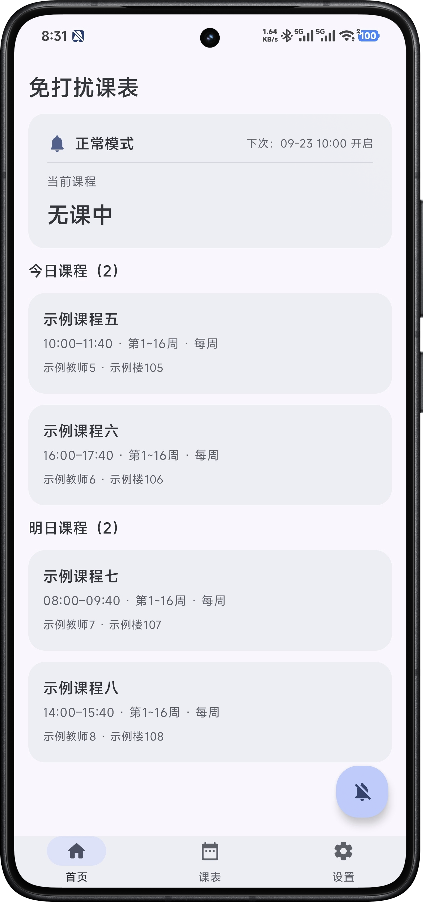
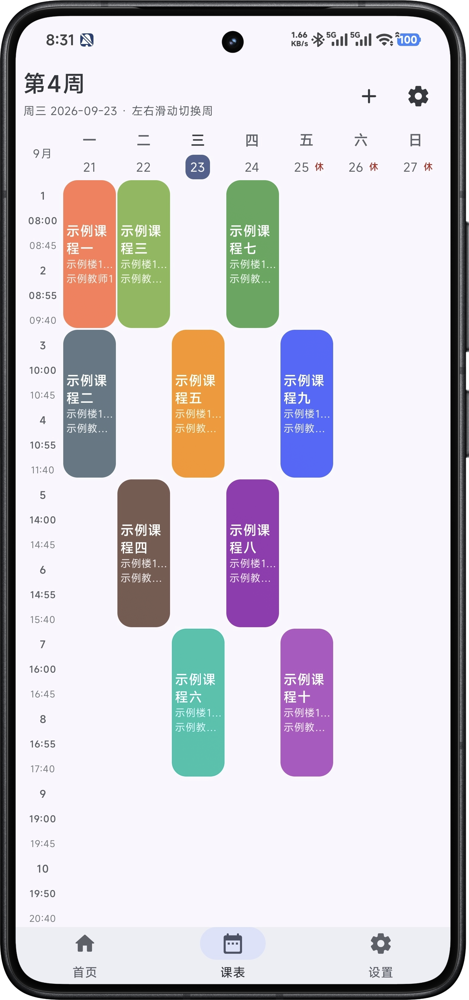
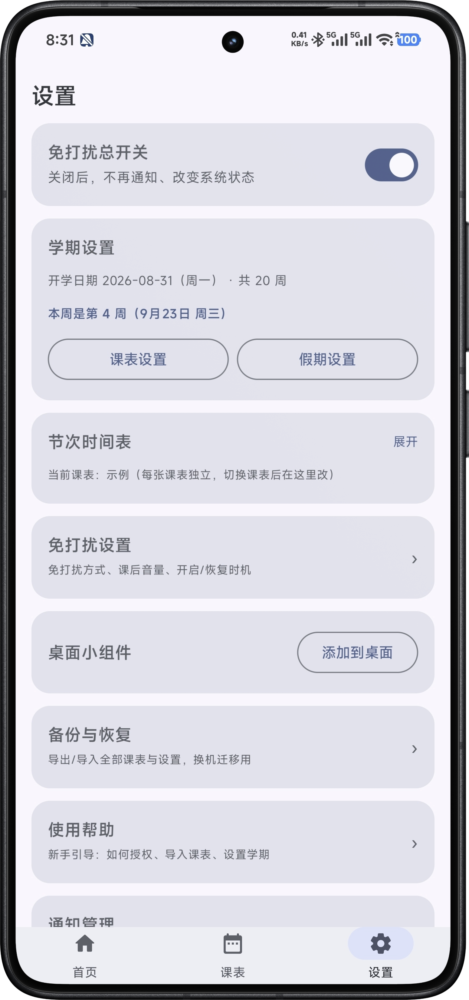

# dndtimetable

Android 应用（应用名：**免打扰课表**），两个功能：

1. **课表** —— 按周查看与管理课程表
2. **免打扰** —— 按课表自动执行，上课时静音/免打扰，下课后自动还原

- Kotlin + Jetpack Compose (Material 3) · minSdk 26 / targetSdk 35 · release 1.98MB

| 首页 | 周网格 | 设置 |
| --- | --- | --- |
|  |  |  |

## 课表

- **周网格视图**：单双周、本周高亮、假期「休」/ 调休「班」角标；点空位添加、复制粘贴、删除
- **多课表**：新建 / 切换 / 重命名 / 删除，每张课表可有独立的节次时间表
- **节次时间表**：默认 10 节，逐节改起止时间与是否参与自动静音，可按规则（45/10/20）重排
- **学期与周次**：开学日期自动归一到周一，周次自动推算
- **特殊日期**：放假区间 / 调休补课；内置法定假期 + 联网拉取更新
- **导入**：Excel / CSV / XLS 一键导入、教务网页登录抓取、文字导入 / 分享进来、AI 生成课表
- **课表分享**：生成文字，对方粘贴即成本学期新课表
- **导出**：JSON 全量备份/恢复（换机迁移）、导入系统日历、.ics 导出
- **桌面小组件**：可缩放，1×1 到 5×5 多种排布

## 免打扰与提醒

- **免打扰三维可组合**：铃声静音 / 屏蔽媒体音（戴耳机自动放行）/ 系统免打扰；上下课缓冲、下课还原方式均可配
- **单门课设置**：整门 / 本学期 / 按周 / 按「日期+节次」关闭或单独指定方式；网络课默认不静音
- **通知**：常驻状态卡（上课前/上课中/课间，文案模板可编辑）、上课前提醒
- **周末默认不自动免打扰**（设置可开）

## 安装

从 [Releases](https://github.com/ZhYue314/dndtimetable/releases) 下载 APK 安装。

首次打开进 4 步引导；**必给**通知使用权 + 精确闹钟 + 通知权限，并按提示放开后台运行限制，否则上课时可能不触发。

## 已知限制

- 仅 Android（minSdk 26），**鸿蒙 / iOS 不支持**
- 后台运行受系统省电策略影响，需按提示放开限制
- 个别 ROM 控制中心音量图标与静音标记可能不同步（系统侧行为），课中可用「兼容模式」锁音量规避

## License

[GPL-3.0](LICENSE)。假期数据同步自 [NateScarlet/holiday-cn](https://github.com/NateScarlet/holiday-cn)（MIT）。
